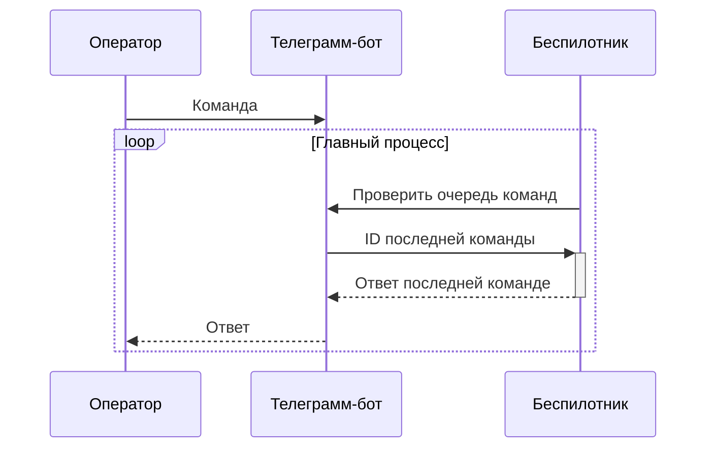
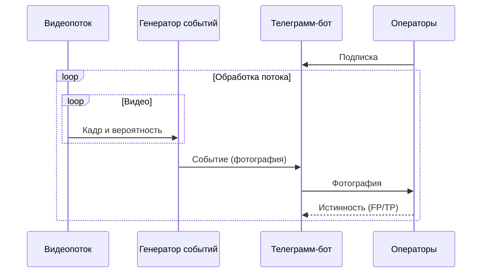

Добро пожаловать в репозиторий СППР, реализующей логику и принятие решений. СППР является связующим звеном между беспилотниками, операторами и службами быстрого реагирования. На данный момент поддерживаются два сценария взаимодействия: 
- удалённое управление беспилотником;
- распознавание событий. 

# Удалённое управление
Удалённое управление беспилотником осуществляется посредством телеграмм-бота. Следуйте шагам, приведённым в следующей инструкции:
1. В телеграмме начните чат с [@copteroperatorbot]( https://t.me/copteroperatorbot).
2. Отправляйте боту команды. 
 - На каждую команду бот может прислать ответ.
 - Бот выполняет только последнюю полученную команду.
 
Сценарий реализуется классом [Manager.py](Manager.py).


 
# Распознавание событий
Сценарий распознавания событий обнаруживает события (дым, пожар, незаконное проникновение и т. п.) в режиме реального времени и рассылает их фотографии операторам (подписчикам телеграмм-бота). Операторы, в свою очередь, могут подтверждать истинность событий.

Сценарий реализуется в следующем порядке:
1. На беспилотник устанавливается система распознавания событий в режиме реального врмени.
2. Система распознавания подключается к генератору событий (класс [EventGenerator.py](EventGenerator.py)).
3. На сервере развёртывается телеграмм-бот (класс [bot4.py](bot4.py)).



# Использование класса Manager
Питоновский класс [Manager.py](Manager.py) реализует удалённое управление беспилотником с помощью web-запросов на сервера телеграмма. В процессе работы записывается лог в файл *<имя исполняемого файла>.log*, например *Manager.py.log*. В некоторых случаях блокировки телеграмма может потребоваться VPN соединение или прокси-сервер. Настройки соединения и бота хранятся в файле [auth.json](auth.json).

Класс требует следующие библиотеки:
- json
- sys
- datetime.datetime
- io.BytesIO
- typing.Dict
- typing.Union
- **telegram.Bot**
- **telegram.utils.request**

Класс реализует следующие интерфейсы:
- `log(message: str) -> None` - записать текст в лог-файл.
- `request() -> int` - получить id последней отправленной (через телеграмм) команды боту и очистить очередь команд. Если команду не удалось распознать, возвращается 0. При отсутствии команд возвращается -1.
- `response( data: Union[str, bytes, bytearray]) -> None` - отправить ответ оператору (последней полученной команде). В качестве параметра могут выступать: текст, байтовый массив фотографии. Формат фотографии определяется телеграммом.
- `listen() -> int` - заблокировать поток до получения ботом команды, затем выполнить `request()`.

Предлагаются два сценария использования класса: блокирующий и неблокирующий. В первом случае класс выступает в роли генератора событий.
```python
import  Manager

manager = Manager()
while True: # main loop
    command_id = manager.listen() # wait for command
    manager.log('Received command #' + str(command_id)) # log command's id
    # do stuff with command_id
    manager.response('Command was processed.') # send response
```
Во втором случае подразумевается следующий код.
```python
import  Manager, time

manager = Manager()
while True: # main loop
    command_id = manager.request() # get command
    if command_id != -1: # check for real command
        manager.log('Received command #' + str(command_id)) # log command's id
        # do stuff with command_id
        manager.response('Command was processed.') # send response
    # do other stuff
    time.sleep(1) # simulate process frequency
```

# Использование класса EventGenerator
{- [Obsolete] Данный класс будет фундаментально изменён в следующей версии. -}

Питоновский класс [EventGenerator.py](EventGenerator.py) реализует реализует генерацию событий и их передачу на сервер по TCP. Использует библиотеку *socket*.

Для корректного использования класса следуйте инструкции:
1. Создайте экземпляр генератора событий. В аргументах укажите:
    - частоту кадров (FPS) видеопотока (30 по умолчанию);
    - время ожидания (60 секунд по умолчанию) между генерацией двух событий (чтобы предотвратить спам);
    - IP адрес и порт сервера с телеграмм-ботом.
2. Каждый кадр вашего видеопотока перенаправляйте в генератор событий, используя метод `grab(frame, score)`, где
    - `frame` - байтовое представления фотографии (формат фотографии определяется телеграммом),
    - `score` - вероятность распознанного события на данной фотографии.
    
Генератор событий на каждом временном интервале выбирает фотографию с наиболее вероятно распознанным событием и отправляет её в конце интервала на сервер.

В примере ниже вместо видеопотока используется статическое изображения со случайной вероятностью.
```python
import EventGenerator, time, random

generator = EventGenerator(fps=1) # Будем использовать видеопоток с 1 кадром в секунду
with open('img.jpg', "rb") as file: # Создадим статический кадр
    img = file.read()
while True:
    generator.grab(img, random.random()) # Передаём кадр и случайную вероятность в генератор событий
    time.sleep(1) # Симулируем 1 FPS
```

# Использование класса bot4
{+ [Beta] Возможны изменения данного класса в следующей версии. +}

Питоновский класс [bot4.py → Server](bot4.py) реализует рассылку и управление событиями операторами с помощью web-запросов на сервера телеграмма. В процессе работы записывается лог в файл *<имя исполняемого файла>.log*, например *bot4.py.log*. В некоторых случаях блокировки телеграмма может потребоваться VPN соединение или прокси-сервер. Настройки соединения и бота хранятся в файле [auth.json](auth.json).

Класс использует следующие библиотеки:
- json
- socket
- sys
- time
- io.BytesIO
- datetime.datetime
- **telegram.Bot**
- **telegram.utils.request**

Инструкция использования класса:
1. Создать новый экземпляр, указав прослушиваемый сервером событий интерфейс. На этот интерфейс генератор событий должен отправлять фотографии.
2. \* По желанию добавить свои обработчики текстовых сообщений, используя метод сервера `handle(text,function (bot, update))` (подробнее см. API телеграмма).
3. Запустить блокирующий поток метод сервера `run()`.

Работа бота делится на такты. Каждый так бот проверяет наличие сообщений в телеграмме, затем событий от генератора событий, далее останавливается на некоторое время, после запускает следующий такт.

В примере ниже используется антипаттерн Воняющий подгузник (The Diaper Pattern Stinks) для безотказной работы сервера.
```python
from bot4 import Server

server = Server()
while True:
    try:
        server.run() # Сервер сам всё делает и блокирует поток до возникновения ошибки
    except:
        server.log('Ошибка времени выполнения. Сервер перезапущен.') # Не повторять - опасно для зарплаты
``` 
